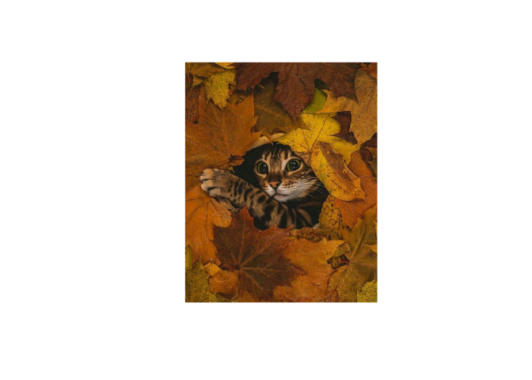

<!-- README.md is generated from README.Rmd. Please edit that file -->

# gatitos

<!-- badges: start -->

[](https://github.com/curso-r/gatitos/actions/workflows/check-release.yaml)

[](https://github.com/curso-r/gatitos/actions/workflows/render-rmarkdown.yaml)
<!-- badges: end -->

Plot de um gatinho aleatório.

``` r
library(gatitos)
gerar_gatito()
```


